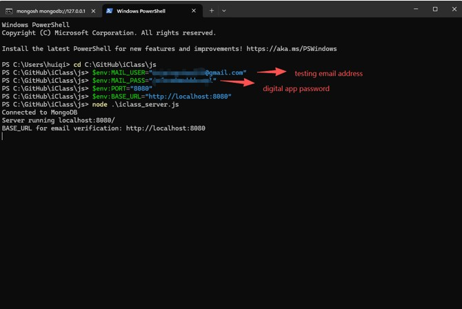
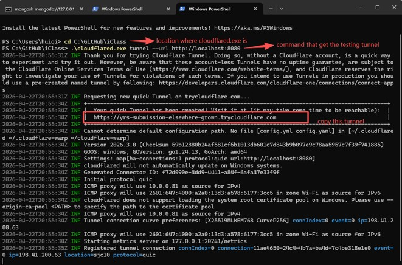
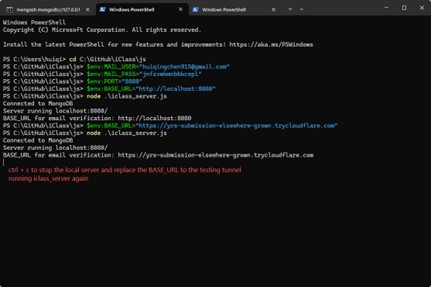
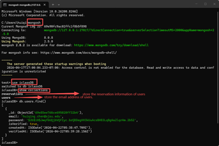
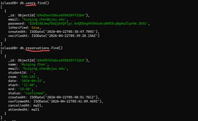

<h1>
  
  iClass
</h1>

## 📌 Overview

**iClass** is a web-based classroom search and reservation system for the Engineering Building at San José State University. It allows users to view classroom availability, browse schedules, create accounts, reserve rooms, and submit complaints.

## 📝 Description

In iClass, our goal is to allow the students of SJSU the opportunity to find more accessible study spaces. The Student Union and MLK Library can get extremely crowded and inconvenient for a place to study, but it can be inappropriate to enter classrooms as classes may occur at any time.

This is where we come in. We at iClass have sourced publicly available data on classroom schedules to present students and faculty at SJSU with the ability to find available classrooms and "reserve" them. This increases productivity, reduces stress, and allows coordination between students on where they book their rooms.

There is an additional layer of security in that only those with an official .sjsu domain email address may reserve rooms, so faculty can view who has booked rooms at certain times if needed.

iClass also includes a complaints tab that allows users to report issues such as occupied rooms, scheduling conflicts, or misuse of the reservation system.

**Disclaimer:** The publicly sourced information does not include every classroom or every time slot. If a room is occupied, it is up to the user's discretion to leave, especially if an official SJSU activity is taking place. Abuse of this system may result in bans, complaints being filed, and potential reporting to SJSU.

---

## 🚀 Features

- View available classrooms and schedules  
- Sign up with SJSU email + email verification  
- Sign in and sign out  
- Submit classroom reservation requests  
- Store reservations in MongoDB  
- Email confirmation for reservations  
- View reservations in **My Profile** after confirmation  
- Edit user info (name & SJSU ID)  
- Cancel or mark reservations as attended  
- View reservation history  
- Submit complaints through the complaints tab  

---

## 🛠️ Technologies Used

- HTML  
- CSS  
- JavaScript  
- Node.js  
- Express.js  
- MongoDB  
- Nodemailer  

---

## 📁 Project Structure

```bash
iClass/
│-- images/
│-- js/
│   ├── helpers.js
│   ├── iclass_server.js
│   ├── main.js
│   ├── nav.js
│   ├── reservation.js
│   └── schedule.js
│-- index.html
│-- reserve.html
│-- myProfile.html
│-- signIn.html
│-- signUp.html
│-- signInSuccess.html
│-- signUpSuccess.html
│-- styles.css
│-- reservation.css
│-- package.json
`-- README.md
```

---

## 📥 How to Download the Project

### Option 1: Clone from GitHub

```bash
git clone https://github.com/shretodorito27/iClass.git
```

### Option 2: Download ZIP
- Open the GitHub repository
- Click Code
- Click Download ZIP
- Extract the ZIP folder

---

## ⚙️ Requirements

- Node.js  
- MongoDB Community Server  
- MongoDB Shell (mongosh) or Compass  
- Gmail account with App Password  

---

## 🛠️ Compilation

This project does not require a separate compilation step, as it is executed directly using Node.js.

---

## 📦 How to Install Dependencies
Open a terminal in the project root folder and run:
```bash
npm install
```
---

## 🗄️ MongoDB Setup

Start MongoDB on your local machine. The project uses the database iclassDB with the collections users and reservations.
You can check the database in mongosh with:
```bash
show dbs
use iclassDB
show collections
db.users.find()
db.reservations.find()
```

---

## ✉️ Email Setup (Nodemailer)

This project uses Nodemailer with Gmail. You need your Gmail address and a Gmail App Password, not your normal Gmail password.

---

## ⚙️ Environment Variables
Before running the server, set the following variables in PowerShell:

```powershell
$env:MAIL_USER="your_email@gmail.com"
$env:MAIL_PASS="your_app_password"
$env:BASE_URL="http://localhost:8080"
```
If you are testing email confirmation from outside your local machine using Cloudflare Tunnel, replace **BASE_URL** with your public tunnel URL.

### Step 1:


### Step 2:


### Step 3:


---

## ▶️ How to Run the Project
### Step 1:
Start MongoDB and make sure it is running locally.
### Step 2:
Start the server from the project folder:
```bash
node .\\js\\iclass_server.js
```
### Step 3:
Open the project in a browser at http://localhost:8080.

### The commands to show information in Mongo database:



---

## 🌐 Optional: Cloudflare Tunnel

```bash
cloudflared tunnel --url http://localhost:8080
```
Then set the BASE_URL environment variable to your trycloudflare URL and restart the Node.js server.

---

## 🧑‍💻 How to Use the System

### Sign Up
Create an account using an SJSU email and verify via email.

### Sign In
Log in using your verified account.

### Reserve a Room
Fill out reservation form and confirm via email.  
Users may reserve up to a maximum of 6 total hours per day.

### My Profile
- View current reservations  
- Cancel or mark as attended  
- View reservation history  

### Complaints Tab
Report issues such as occupied rooms, scheduling conflicts, or misuse of the system.

---

## 📜 Reservation Rules

- Only SJSU emails allowed  
- No past date/time reservations  
- Start time must be before end time  
- Must confirm reservation via email  
- Users may reserve up to 6 total hours per day  
- Additional reservations exceeding this limit will be rejected  

---

## 🔗 Repository

https://github.com/shretodorito27/iClass

---

## 👥 Authors

iClass Development Team  

### Acknowledgments
This project utilized assistance from AI tools, including ChatGPT and GitHub Copilot, for code suggestions, debugging, and documentation support.

---
